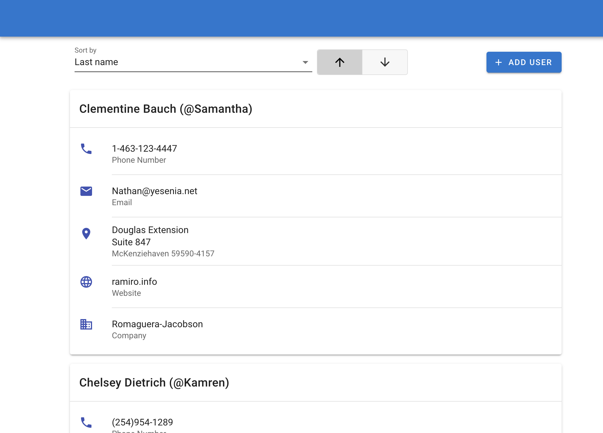
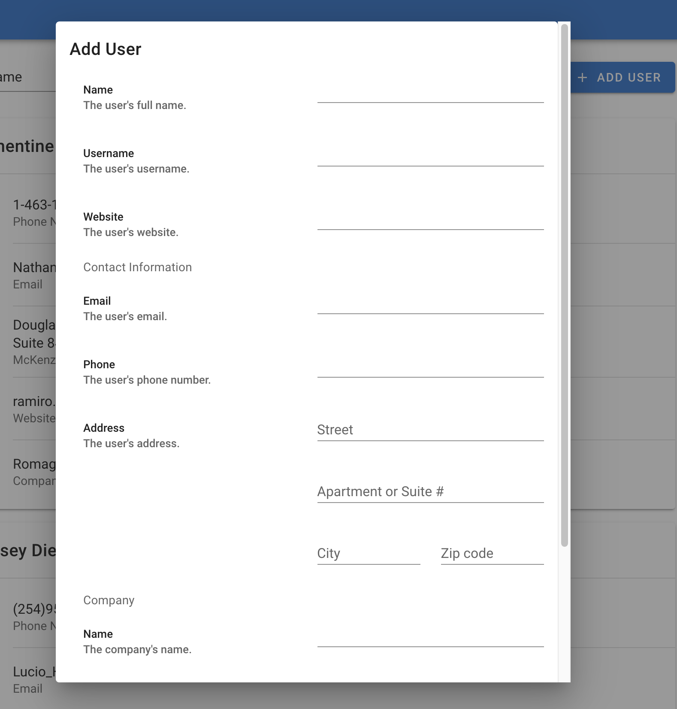

# User Cards

## Screenshots

### Viewing users



### Adding a user



## Functionality

User Cards is a vue app that demonstrates loading data from an external service, sorting it,

and adding a new record (on the front-end).

## Design decisions

### Inconsistent data format

Phone numbers are not consistently formatted. Website addresses are missing http/https.

We could apply a "fix" by formatting this data for presentation on the front-end, but this really should be handled in either the database or (worst case) at the services layer of the backend.

### Choosing what to present

We're showing most of the data that's returned to us from the API. We're not showing ids, geographic coordinates, and some of the additional company information because we're assuming this isn't interesting/useful to the user.

## Assumptions

- All the displayed information will always be present in the database (with the exception of the suite in the address).

- We can get the last name by splitting a user's name by spaces and taking the last item (if this were a real project we'd be storing first and last names separately, hopefully?)

- We're adding companies with users and never sharing a company (in an actual application a we'd probably search for an existing company before adding a new one)

- We are targetting English-speaking US audiences.

## Project setup

```
yarn install
```

### Compiles and hot-reloads for development

```
yarn serve
```

### Compiles and minifies for production

```
yarn build
```

## TODO

Once this gets much bigger we should add automated tests: unit and e2e.

## Requirements

### Coding Exercise - User Cards

#### Purpose

The purpose of this exercise is to gain insight into your HTML, CSS, JS (emphasis on Vue), and UI design skills.

#### Requirements

These requirements are intentionally high-level, in order to give you creative control.

- Upon opening, the page loads the users (JSON) from the data URL (below)
- The page displays each users’ profile data in a nice card-based UI
- The top of the page offers a sorting feature, with both ascending and descending “Last
  Name” as options, as well as zip code
- At the top of the page there is an “Add User” button
- When that button is clicked a new-user form exands
- The form provides the necessary fields to create a user with similar attributes to
  the existing users in the list (company name, zip code, website, name, etc., etc.)
- When the form is submitted the new user’s card is added to the page, in its
  proper sorting order
- Please complete this task using only the libraries listed below, so that we can see your
  raw HTML, CSS, and JS coding skills in action
  Expected Output
  The result of this challenge should be plain HTML, CSS, and JS files, unminified in their original format. The HTML page should be able to be opened directly as a file (no server, etc.).

#### Data

- URL: https://jsonplaceholder.typicode.com/users

#### Must Use

- Vue (https://vuejs.org/)
